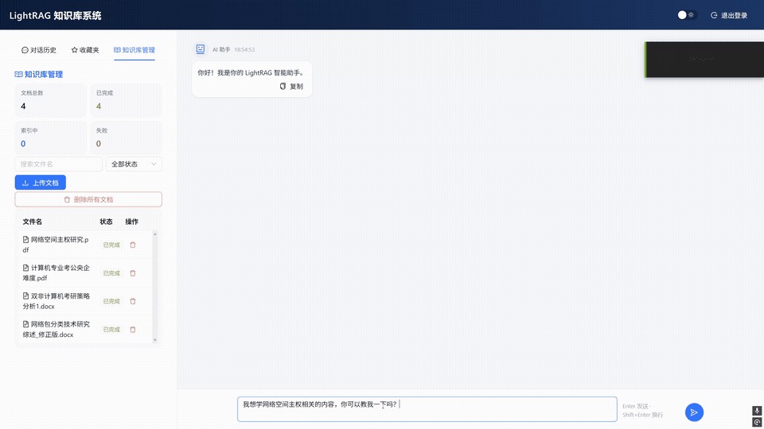

# 基于 Agentic RAG 的企业级多部门知识共享系统

基于 LightRAG 引擎构建，支持文档智能解析、多路混合检索、Agentic 自纠错问答、引用溯源与多部门数据隔离。

**适用场景**：企业内部知识库建设（技术研发部、产品部、运营部等多部门独立管理、共享问答）、团队级私有化智能助手、跨部门协作中的信息检索与引用溯源。



## 程序流程

```
用户上传文档
    │
    ▼
Celery 异步索引 ──► 文本切分 ──► 实体/关系提取 ──► 向量入库(Qdrant)
    │                                                      │
    ▼                                                      │
用户提问                                               检索时
    │                                                      │
    ▼                                                      ▼
关键词提取 + 复杂度分级(L1/L2/L3)              混合检索：图谱 + 向量 + 关键词
    │                                                      │
    ▼                                                      ▼
HyDE 生成假设文档(可选) ◄────────────────────── 召回 chunks
    │                                                      │
    ▼                                                      ▼
Agentic RAG 循环：                                Rerank 精排
  QueryResolver 消解歧义                             │
  RetrievalGrader 评分 ──► 不通过 ──► QueryRewriter 改写   │
    │                                                      │
    └──────────────────────── 通过 ────────────────────────┘
                           │
                           ▼
                    LLM 生成回答(带引用标注)
                           │
                           ▼
                    流式返回给用户
```

## 优化准确度的方法

### 检索层

| 优化点 | 做法 |
|--------|------|
| **混合检索** | 同时走图谱（实体/关系）+ 向量（chunk embedding）+ 关键词三路召回，合并去重后送 Rerank |
| **Rerank 精排** | 用 qwen3-rerank 模型对召回的 chunks 重打分，按相关性排序后截取 top N |
| **HyDE 增强** | 先用 LLM 生成假设回答，再对假设回答做向量检索，补充原始 query 召回不到的相关片段 |
| **引用锚点注入** | 检索阶段就把 `[n]` 编号注入 chunk 文本开头，LLM 生成时自然引用 |
| **参考文献过滤** | 当用户问题明确要求文献时，过滤掉非引用来源的 chunk，减少噪音 |
| **图谱 truncation** | 限制实体和关系的 token 数量，避免低质量图谱信息挤占上下文窗口 |

### 生成层

| 优化点 | 做法 |
|--------|------|
| **动态模型路由** | 按查询复杂度分流：L1 简单题走轻量模型，L2 常规题走中档模型，L3 复杂题走最强模型 |
| **Agentic RAG 自纠错** | QueryResolver 消解对话歧义 → RetrievalGrader 评估召回质量 → 不通过则 QueryRewriter 改写后重试 |
| **引用溯源** | LLM 输出的 `[n]` 编号反查对应 chunk，前端展示真实文档名和原文片段，点击可跳转 |
| **孤儿引用清理** | LLM 编造的不存在的 `[n]` 编号在返回前被自动过滤，避免假引用 |
| **上下文记忆** | 保留多轮对话历史，支持追问和指代消解 |

### 工程层

| 优化点 | 做法 |
|--------|------|
| **索引/查询模型分离** | 索引用轻量模型（qwen-turbo，快 3-5x），查询按复杂度用中高档模型 |
| **Per-Workspace 引擎隔离** | 按 workspace（`dept_{id}` 或 `user_{id}`）隔离引擎与数据，同部门成员共享知识库 |
| **Embedding 批量化** | 单条 embedding 改批量提交，API 调用次数从几十次降到几次 |
| **top_k 截断** | 检索阶段从 40 降到 20，减少 LLM 上下文 token 消耗和无关信息干扰 |

## 技术栈

| 层级 | 技术 |
|------|------|
| 前端 | React + Vite + Ant Design |
| 后端 | FastAPI + SQLAlchemy(MySQL) |
| 检索引擎 | LightRAG + Qdrant(向量库) |
| 任务队列 | Celery + Redis |
| LLM | 阿里云百炼 (Qwen / DeepSeek 系列) |
| 嵌入模型 | text-embedding-v4 |

## 部门隔离机制

系统支持**部门级知识库共享**与**个人知识库隔离**两种模式：

- **有部门的用户**：workspace = `dept_{department_id}`，同部门所有成员共享同一套文档、向量索引和问答结果
- **无部门的用户**：workspace = `user_{user_id}`，数据完全个人隔离

底层实现上，所有用户共用同一组 Qdrant collection（`lightrag_vdb_*`），通过 `workspace_id` payload 字段过滤数据；本地文件按 `./data/{workspace}/` 目录隔离。

## 项目结构

```
.
├── app/                    # 后端代码
│   ├── api/                # API 路由
│   ├── rag/                # RAG 引擎
│   ├── services/           # 业务服务
│   └── core/               # 配置、安全、全局变量
├── frontend/               # React 前端
├── benchmark/              # 评测框架
├── data/                   # 用户数据（按 workspace 隔离：dept_X 或 user_X）
└── docs/                   # 开发文档
```
